# PRJ300 — Emergency App

A cross-platform mobile app built with Ionic and Angular, deployed via Capacitor to both iOS and Android. Users can report and view community alerts, receive push notifications for nearby emergencies, view live weather alerts, and locate nearby defibrillators complete with photos and notes.

---

## Team

| Name | Student ID |
|------|------------|
| Adam Hoban | S00253815 |
| Adam Fay | S00238688 |
| Kyle Flynn | S00251601 |

---

## Screenshots

### Login
<p>
  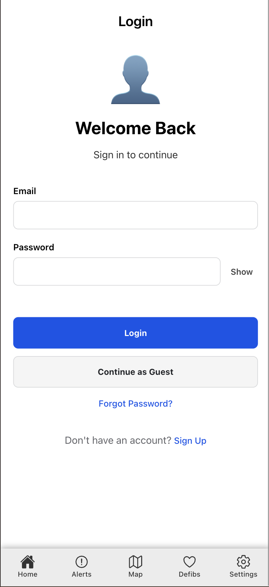
  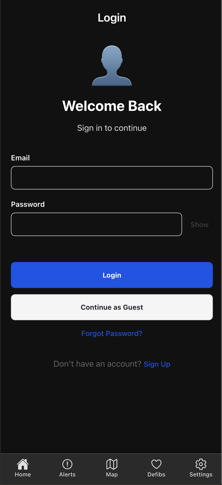
</p>

### Sign Up
<p>
  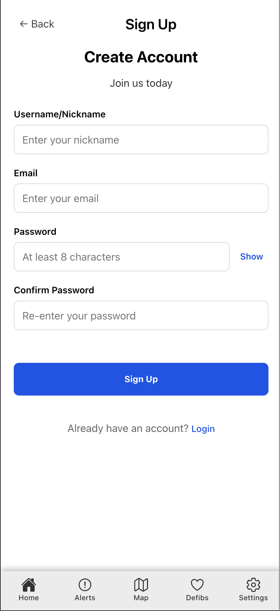
  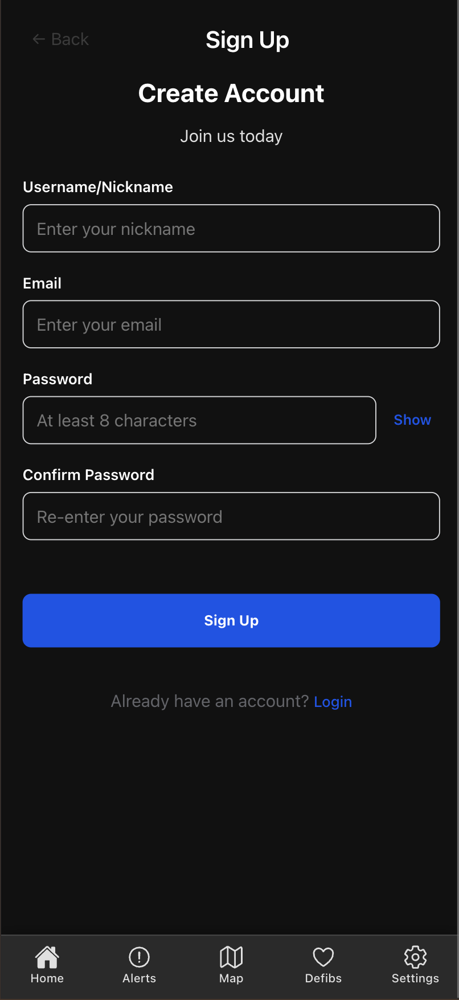
</p>

### Home
<p>
  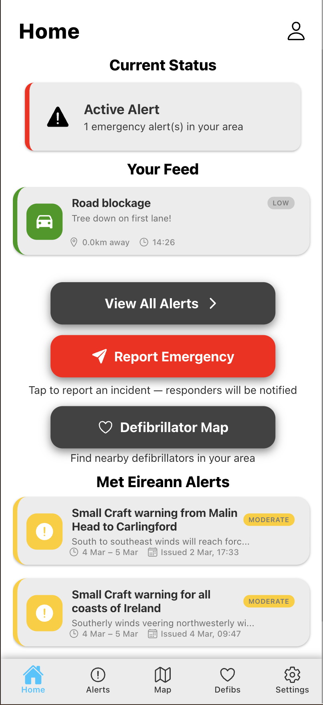
  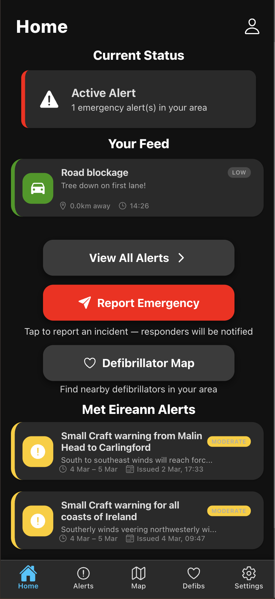
</p>

### Report an Alert
<p>
  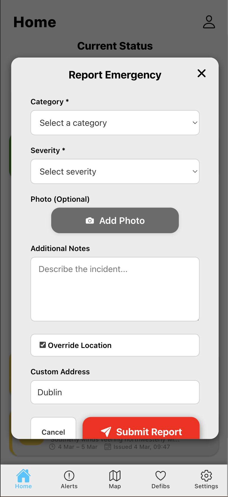
  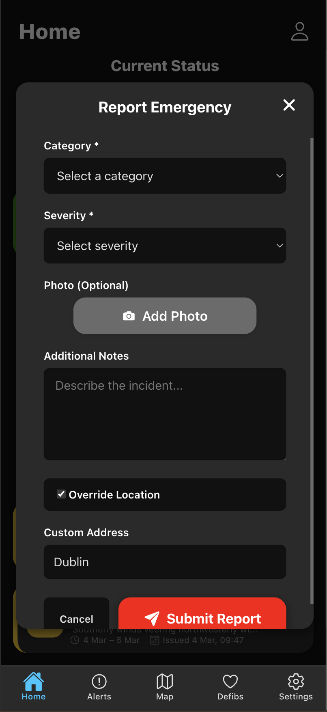
</p>

### Alerts List
<p>
  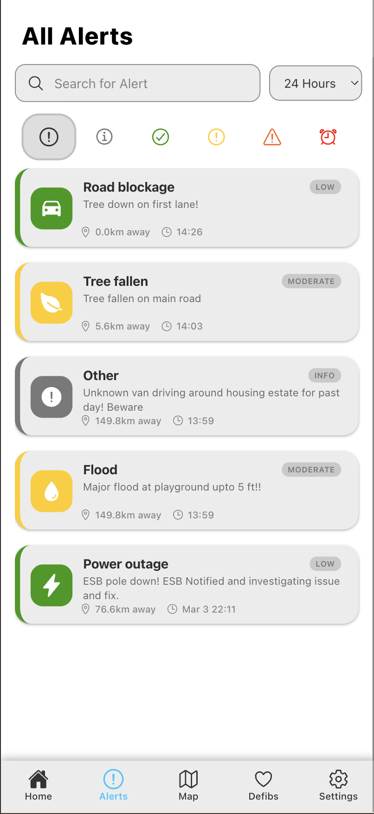
  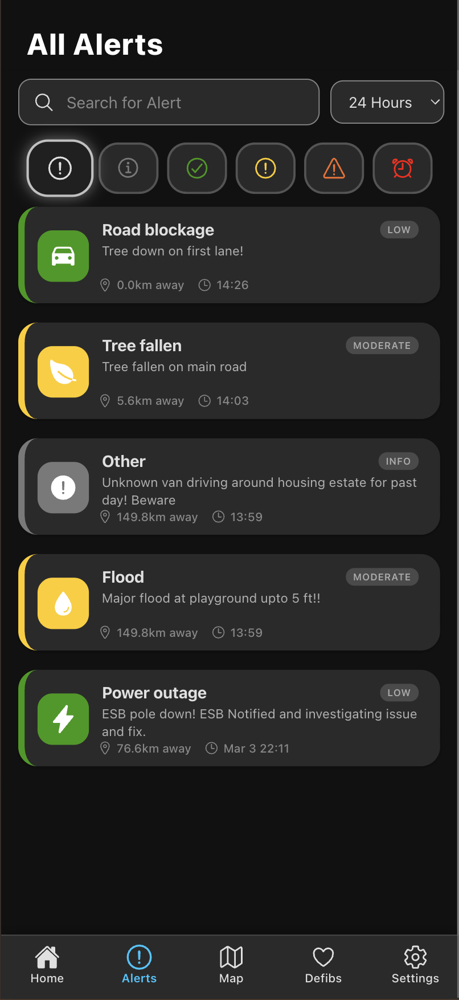
</p>

### Alert Detail
<p>
  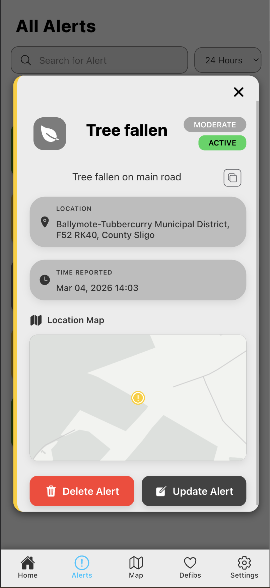
  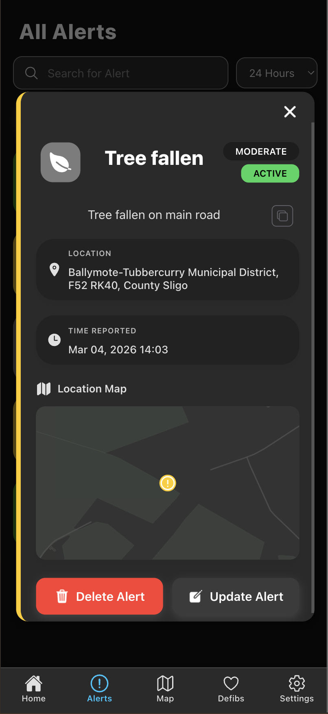
</p>

### Alert Map
<p>
  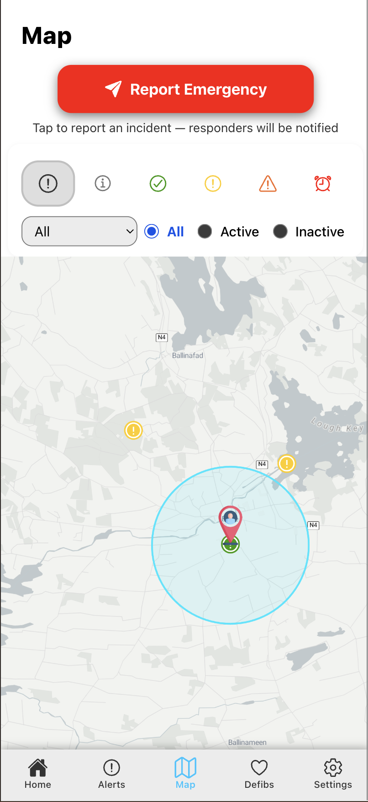
  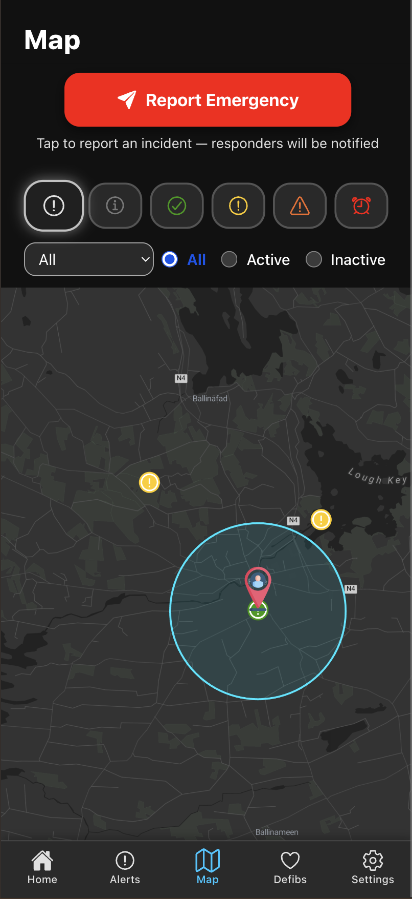
</p>

### Weather
<p>
  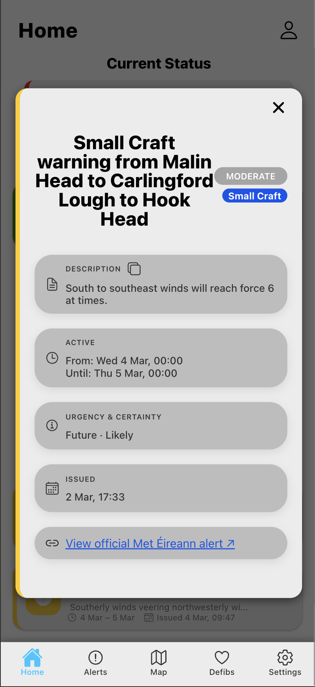
  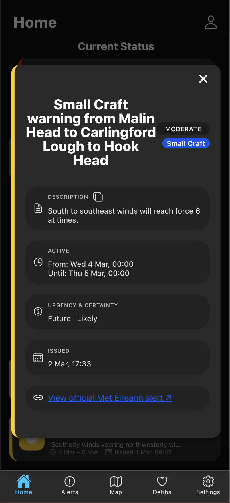
</p>


### Defibrillator Map
<p>
  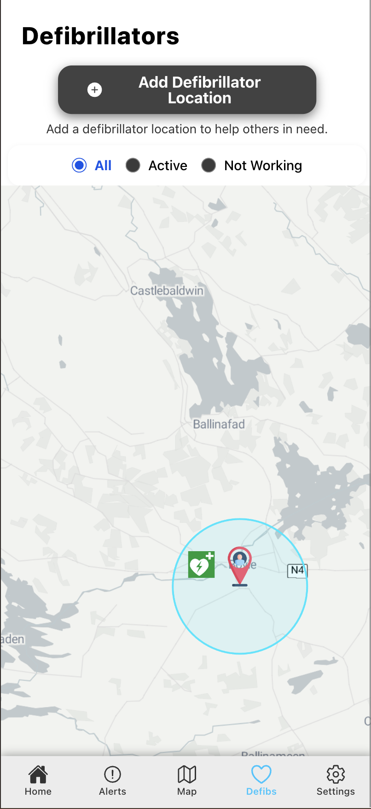
  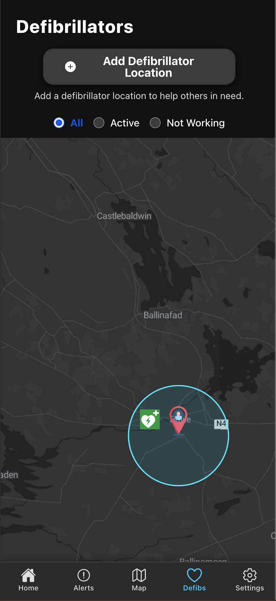
</p>

### Settings
<p>
  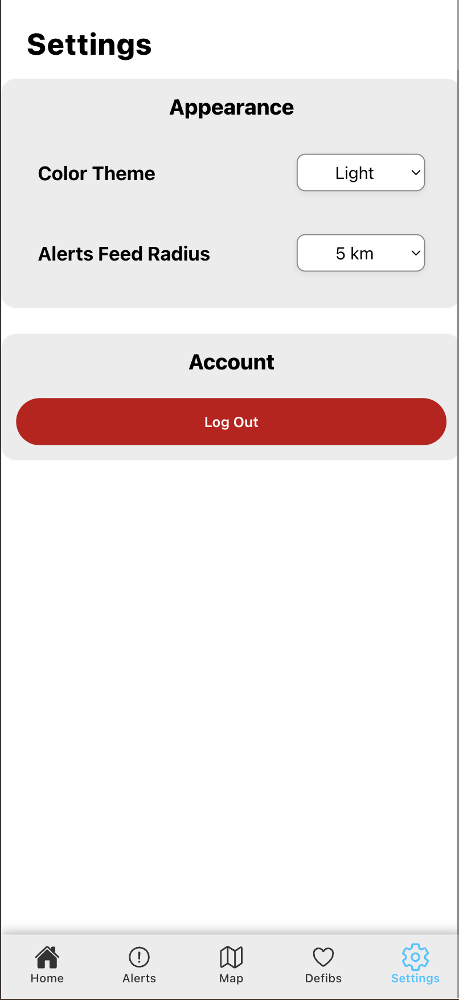
  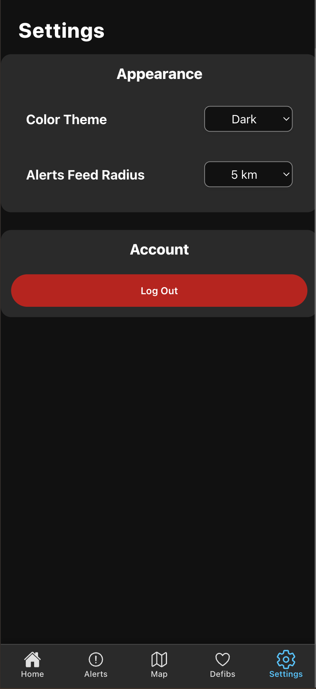
</p>

---

## Tech Stack

| Area | Technology |
|------|-----------|
| Frontend | Ionic, Angular |
| Native bridge | Capacitor (camera, GPS, push, clipboard) |
| Map | OpenLayers + Stadia Maps (`alidade_smooth` / `alidade_smooth_dark`) |
| Backend | Node.js / Express — hosted on AWS EC2 |
| Database | MongoDB |
| Auth | AWS Cognito + AWS Amplify (JWT) |
| Photo storage | AWS S3 |
| Push notifications | Firebase Cloud Messaging (FCM) |
| Geocoding | Nominatim (OpenStreetMap) |
| Weather alerts | Met Éireann CAP feed |

**Backend URL:** `https://prj300emergecnyapp.freedynamicdns.net`

---

## Installation

**Prerequisites:** Node.js >= 18, Ionic CLI (`npm install -g @ionic/cli`), Xcode (iOS) or Android Studio (Android)

```bash
git clone <repo-url>
cd PRJ300-EmergencyApp/emergency-app
npm install
```

### Run in browser
```bash
ionic serve
```

### Run on iOS
```bash
ionic build && npx cap sync ios && npx cap open ios
```
Press **Run** in Xcode with your device connected.

### Run on Android
```bash
ionic build && npx cap sync android && npx cap open android
```
Press **Run** in Android Studio. To export an APK: **Build → Build APK(s)**.

---

## Push Notifications (FCM)

FCM requires two config files placed in the native projects before building:

| File | Path |
|------|------|
| `google-services.json` | `android/app/google-services.json` |
| `GoogleService-Info.plist` | `ios/App/App/GoogleService-Info.plist` |

Download both from the Firebase console under **Project Settings → Your apps**. Without them the app builds fine but push notifications won't work.

---

## Android Permissions

Location access must be declared in `android/app/src/main/AndroidManifest.xml`. The following are already added — if they are missing for any reason, add them inside the `<manifest>` tag:

```xml
<!-- Geolocation Plugin -->
<uses-permission android:name="android.permission.ACCESS_COARSE_LOCATION" />
<uses-permission android:name="android.permission.ACCESS_FINE_LOCATION" />
<uses-feature android:name="android.hardware.location.gps" />
```

- `ACCESS_COARSE_LOCATION` — approximate location (network-based)
- `ACCESS_FINE_LOCATION` — precise GPS location (required for nearby alert detection)
- `uses-feature` — declares GPS hardware as used (affects Play Store filtering)

On Android 12+, users can choose between **Approximate** (`COARSE`) or **Precise** (`FINE`) location at the OS prompt. The app requests both so either choice works.

---

## iOS Permissions

iOS requires privacy usage descriptions in `ios/App/App/Info.plist`. These are already added — if missing, add them inside the root `<dict>`:

```xml
<key>NSLocationWhenInUseUsageDescription</key>
<string>We need your location to report emergencies</string>
<key>NSLocationAlwaysAndWhenInUseUsageDescription</key>
<string>We need your location to report emergencies</string>
<key>NSCameraUsageDescription</key>
<string>Allow access to the camera to take photos for reports and alerts.</string>
<key>NSPhotoLibraryUsageDescription</key>
<string>Allow access to your photo library to choose photos for reports.</string>
<key>NSPhotoLibraryAddUsageDescription</key>
<string>Allow saving photos taken in the app to your photo library.</string>
```

| Key | Purpose |
|-----|---------|
| `NSLocationWhenInUseUsageDescription` | Location while app is open (GPS for nearby alerts) |
| `NSLocationAlwaysAndWhenInUseUsageDescription` | Required alongside the above when requesting location |
| `NSCameraUsageDescription` | Camera access for taking report photos |
| `NSPhotoLibraryUsageDescription` | Photo library access for choosing existing photos |
| `NSPhotoLibraryAddUsageDescription` | Permission to save photos to the library |

Without these keys the app will crash on iOS when requesting the relevant permission.

---

## Project Structure

```
emergency-app/
├── src/
│   ├── app/
│   │   ├── components/     # Modals, map, shared UI
│   │   ├── pages/          # Home, Alerts, Map, Defibs, Settings
│   │   ├── services/       # Alerts, auth, geolocation, notifications
│   │   ├── interfaces/     # TypeScript interfaces
│   │   └── utils/          # Helper functions
│   ├── environments/       # API keys and config
│   └── global.scss         # Global styles
├── android/                # Capacitor Android project
├── ios/                    # Capacitor iOS project
└── capacitor.config.ts
```